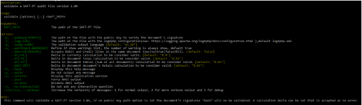
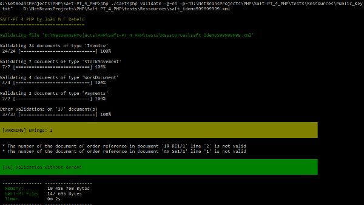

# Rebelo SAFT-PT

---

Rebelo SAFT-PT is a PHP library/framework to lead with the Portuguese tax audit file. The community edition lets to generate, parse, import and validate programmatically or CLI the Portuguese Tax Audit file SAFT-PT.  This library also create the digital signature that is impose by law to all invoice, transport documents and working documents issued im Portugal.
The enterprise edition also submit the SAFT-PT file to the Portuguese Tax Authority e-fatura web site.

### Install

```bash
composer require joaomfrebelo/saft-pt_4_php
```

#### Examples

https://github.com/joaomfrebelo/Saft-PT_4_PHP/tree/master/examples

#### Legal documentation, portuguse tax law

https://github.com/joaomfrebelo/Saft-PT_4_PHP/tree/master/legal_documentation

Parse and validate a SAFT-PT file:

```php
$auditFile = \Rebelo\SaftPt\AuditFile\AuditFile::loadFile("/path/to/file");
$auditFile->validate();
if ($auditFile->getErrorRegistor()->hasErrors()) {
    // Do stuff
} else {
    // read and integrate data to you database ERP 
}
```

Create the signature hash

```php
$sign = new Rebelo\SaftPt\Sign\Sign();
$sign->setPrivateKey($privatekey);
$hash = $sign->createSignature($docDate, $systemEntryDate, $doc, $grossTotal, $lastHash);
```

Validate the hash signature

```php
$sign = new Rebelo\SaftPt\Sign\Sign();
$sign->setPublicKey($publicKey);
$isValid = $sign->verifySignature($hash, $docDate, $systemEntryDate, $doc, $grossTotal, $lastHash);
```

Create a SAFT-PT file

```php
$audit = new AuditFile();
$header = $audit->getHeader();
$header->setCompanyID($companyID);
$header->setTaxRegistrationNumber($taxRegistrationNumber);
$header->setTaxAccountingBasis(Rebelo\SaftPt\AuditFile\TaxAccountingBasis::FACTURACAO());
$header->setCompanyName($companyName);
$header->setBusinessName($businessName);
(...)
// Expoert to file
$audit->toFile("/path/to/file");
```

CLI file validation

```bash
./vendor/bin/saft4php validate -g=en -p=/path/to/Public_Key.txt" -- /path/saft.xml
```

```bash
./vendor/bin/saft4php validate /path/saft.xml
```

To more options like delta, help

```bash
./vendor/bin/saft4php validate --help
```

#### 

#### Using as stand alone SAFT-PT validator

First clone or download the project

```bash
git clone https://github.com/joaomfrebelo/Saft-PT_4_PHP.git
```

In the project root (php  >= 7.4 installed)

```bash
php saft4php validate /path/saft.xml
```

#### 

#### Some type of validations

- XML scheme

- Document values

- Total values

- Documents number sequence

- Signature

- Address where are mandatory

- Dates

- And other stuff

#### API documentation

https://joaomfrebelo.github.io/Saft-PT_4_PHP/

### Professional support:

https://www.pchouse.pt

joao.rebelo@pchouse.pt

| Features                       | CE  | EE  |
| ------------------------------ |:---:|:---:|
| Generate SAFT                  | yes | yes |
| Parse SAFT                     | yes | yes |
| Create hash signature          | yes | yes |
| Validate file programmatically | yes | yes |
| Validate file CLI              | yes | yes |
| Validate hash signature        | yes | yes |
| Submit file to e-fatura        | no  | yes |

### License

MIT License
